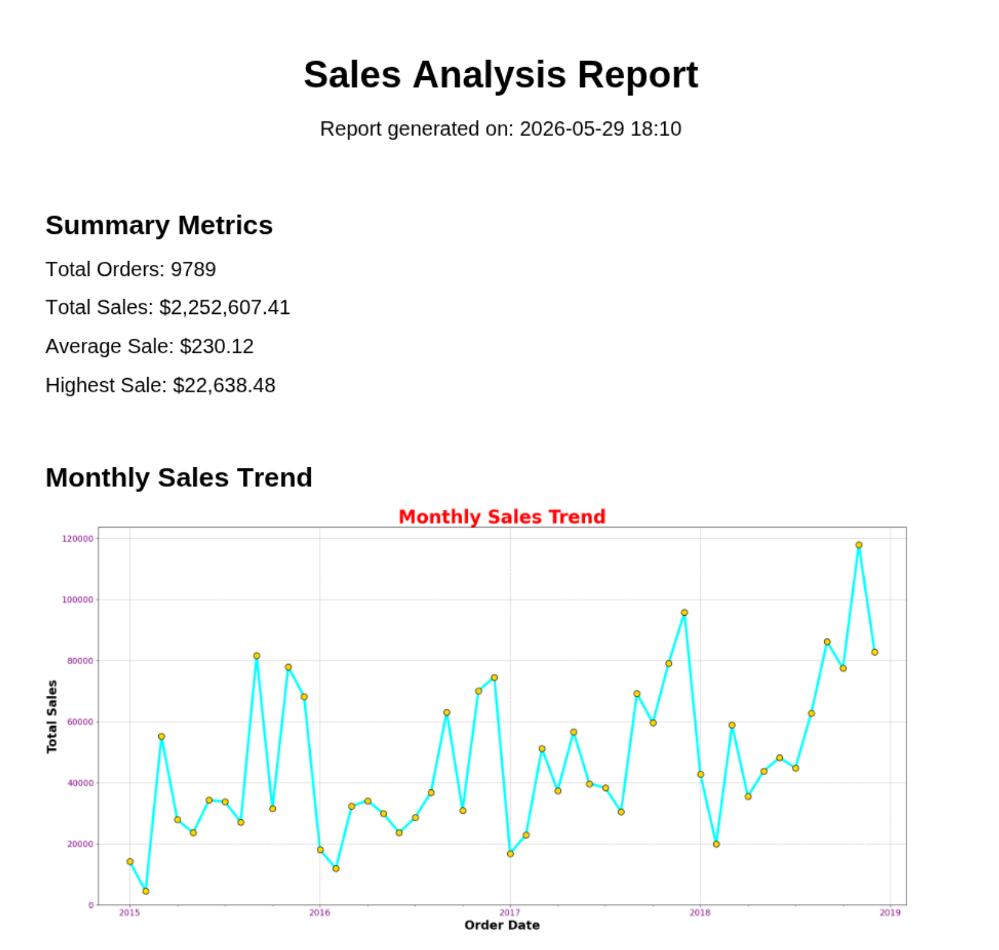
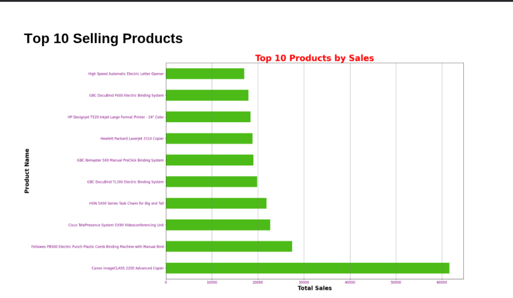

# Smart Sales Data Analyzer

## Overview

Smart Sales Data Analyzer is a beginner-level Python project built to practice **data analysis, visualization, and automated reporting**.

The program processes a raw CSV sales dataset, cleans the data, identifies trends, generates charts, and automatically compiles the results into a structured PDF report.

This project was created as a **learning exercise while developing practical Python and data analysis skills**, focusing on tools commonly used in real-world workflows such as pandas, matplotlib, and automated reporting.

The goal of the project is to demonstrate the ability to:

- Clean and process real datasets
- Perform basic business-oriented analysis
- Generate visual insights
- Automate report creation with Python

---

## Features

- Data cleaning (remove duplicates and missing values)
- Sales trend analysis
- Automatic chart generation
- Summary metrics calculation
- Multi-page PDF report generation

---

## Tools & Libraries

- Python 3.7+
- pandas
- numpy
- matplotlib
- fpdf2

---

## Project Structure

```
Smart-Data-Analyzer/
│
├── charts/              # Generated charts
│   ├── monthly_sales.png
│   ├── sales_by_category.png
│   ├── sales_by_region.png
│   └── top_10_products.png
│
├── data/
│   └── sales_data.csv
│
├── output/
│   └── sales_report.pdf
│
├── main.py              # Data analysis and chart generation
├── generate_report.py   # PDF report generation
├── requirements.txt
└── README.md
```

---

## How It Works

### 1. Data Processing

`main.py` reads the dataset and performs:

- Data cleaning
- Date conversion
- Grouping and aggregation

### 2. Visualization

Charts are generated using **matplotlib**:

- Monthly sales trend
- Sales by category
- Sales by region
- Top selling products

The charts are automatically saved in the `charts/` folder.

### 3. Report Generation

`generate_report.py` creates a **multi-page PDF report** using **FPDF2**.

The report includes:

- Report title
- Generation timestamp
- Summary statistics
- Visual charts

---

## 🚀 How to Run

### 1. Install dependencies
```bash
pip install -r requirements.txt
```

### 2. Run the full pipeline
```bash
python main.py && python generate_report.py
```

This runs the analysis and generates the PDF report automatically.
The final report will be saved to `output/sales_report.pdf`

---

## Example Output

The generated PDF report includes:

- Sales summary metrics
- Monthly sales trends
- Regional sales distribution
- Category sales comparison
- Top performing products

> **Note:** Charts are generated when you run `main.py`. The `charts/` folder will be populated after the first run.





---

## Purpose

This project was created to practice:

- Data analysis with pandas
- Data visualization with matplotlib
- Automated reporting with Python

---

## Author

Manish Pandeya