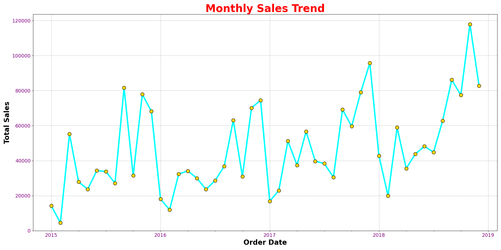

# Smart Sales Data Analyzer

## Overview

Smart Sales Data Analyzer is a beginner-level Python project built to practice **data analysis, visualization, and automated reporting**.

The program processes a raw CSV sales dataset, cleans the data, identifies trends, generates charts, and automatically compiles the results into a structured PDF report.

This project was created as a **learning exercise while developing practical Python and data analysis skills**, focusing on tools commonly used in real-world workflows such as pandas, matplotlib, and automated reporting.

The goal of the project is to demonstrate the ability to:

* clean and process real datasets
* perform basic business-oriented analysis
* generate visual insights
* automate report creation with Python

---

## Features

* Data cleaning (remove duplicates and missing values)
* Sales trend analysis
* Automatic chart generation
* Summary metrics calculation
* Multi-page PDF report generation

---

## Tools & Libraries

* Python
* pandas
* numpy
* matplotlib
* fpdf

---

## Project Structure

```
Smart Data Analyzer
│
├── charts/              # Generated charts
│   ├── Monthly Sales.png
│   ├── Sales By Category.png
│   ├── Sales By Region.png
│   └── Top 10 Products.png
│
├── data/
│   └── sales_data.csv
│
├── output/
│   └── sales_report.pdf
│
├── main.py              # Data analysis and chart generation
├── report_generate.py   # PDF report generation
└── README.md
```

---

## How It Works

### 1. Data Processing

`main.py` reads the dataset and performs:

* data cleaning
* date conversion
* grouping and aggregation

### 2. Visualization

Charts are generated using **matplotlib**:

* Monthly sales trend
* Sales by category
* Sales by region
* Top selling products

The charts are automatically saved in the **charts/** folder.

### 3. Report Generation

`report_generate.py` creates a **multi-page PDF report** using **FPDF**.

The report includes:

* report title
* generation timestamp
* summary statistics
* visual charts

---

## How to Run

### Install dependencies

```
pip install pandas numpy matplotlib fpdf
```

### Run analysis

```
python main.py
```

### Generate report

```
python report_generate.py
```

The final report will be created at:

```
output/sales_report.pdf
```

---

## Example Output

The generated PDF report includes:

* Sales summary metrics
* Monthly sales trends
* Regional sales distribution
* Category sales comparison
* Top performing products



## Purpose

This project was created to practice:

* data analysis with pandas
* data visualization with matplotlib
* automated reporting with Python

---

## Author

Manish Pandeya
